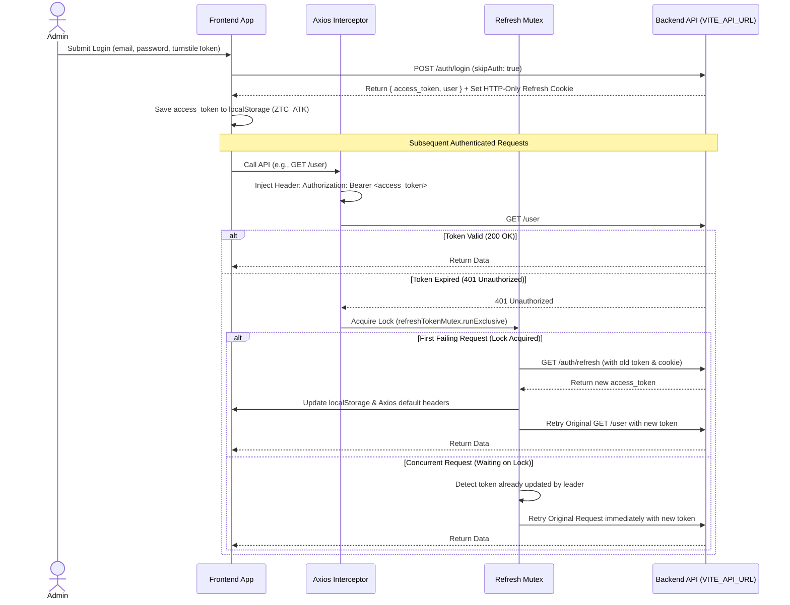

# Technical Architecture & System Design

## Executive Summary
**Ztruyện Admin** is a modern, enterprise-grade administrative dashboard built to manage the Ztruyện online comic reading platform. Designed as a **Monolith Single Page Application (SPA)**, it utilizes **React 18**, **TypeScript**, and **Vite 7**. The system architecture is organized around a clean separation of concerns: a presentation layer powered by **Tailwind CSS v4** and **shadcn/ui**, server-state caching managed by **TanStack Query v5**, flexible data grids via **TanStack Table v8**, and a robust Axios API layer with automated JWT token renewal.

---

## 1. Technology Stack

| Layer | Technology | Version | Purpose & Justification |
| :--- | :--- | :--- | :--- |
| **Core Framework** | React | 18.3.1 | Component-based UI rendering with concurrent mode support. |
| **Build & Dev Tool**| Vite | ~7.3.1 | Ultra-fast Hot Module Replacement (HMR) and optimized ES-module production bundling. |
| **Language** | TypeScript | ~5.9.3 | Static typing, interface definitions, and compile-time error prevention. |
| **Routing** | React Router | 7.13.1 | Client-side routing, protected route guards, and URL parameter syncing. |
| **Styling & UI** | Tailwind CSS / shadcn/ui | v4.2.1 / v3.8.5 | Utility-first styling with accessible, customizable Radix UI / Base UI primitives. |
| **Server State** | TanStack Query | 5.90.21 | Asynchronous data fetching, caching, background refetching, and pagination state. |
| **Data Tables** | TanStack Table | 8.21.3 | Headless data table architecture supporting sorting, filtering, row selection, and resizing. |
| **Forms & Validation**| React Hook Form + Zod | 7.71.2 / 4.3.6 | Performant form state management paired with runtime schema validation. |
| **HTTP Client** | Axios | 1.13.5 | API communication with custom interceptors for header injection and token refresh. |
| **Concurrency** | async-mutex | 0.5.0 | Mutex locking to prevent race conditions during simultaneous refresh token requests. |
| **Drag & Drop** | @dnd-kit/core | 6.3.1 | Accessible drag-and-drop primitives for table row reordering. |
| **Excel I/O** | xlsx | 0.18.5 | Client-side Excel (`.xlsx`) spreadsheet import parsing and export generation. |
| **Security** | Cloudflare Turnstile | 1.1.5 | Bot protection and captcha verification on administrative login forms. |

---

## 2. Architecture Pattern & Layered Design

The application implements a **Layered Component & Module-Based Architecture**. Code is strictly decoupled across four functional tiers:

```text
[ Presentation Tier ]   →   Pages (src/pages/) & Feature Modules (src/modules/)
        ↓
[ State & Cache Tier ]  →   TanStack Query Hooks & React Context (src/hooks/, src/context/)
        ↓
[ Service Tier ]        →   Domain API Wrappers (src/services/)
        ↓
[ Network Tier ]        →   Axios Interceptors & Mutex Lock (src/services/axios-customize/)
        ↓
[ Backend REST API ]    →   Ztruyện Backend Server (VITE_API_URL)
```

### Tier 1: Presentation Tier (`pages/`, `modules/`, `components/`)
* **Pages (`src/pages/`):** Lightweight route targets that set page metadata via `React Helmet Async` and render corresponding feature modules.
* **Feature Modules (`src/modules/`):** Self-contained domain modules (e.g., `User/`, `Ranking/`, `Emoji/`). Each module owns its TanStack Table column definitions, data table wrapper, modals, and Zod form validation schemas.
* **Shared Primitives (`src/components/`):** Reusable UI blocks, including shadcn/ui primitives (`src/components/ui/`) and common business widgets (`src/components/common/`).

### Tier 2: State & Cache Tier (`hooks/`, `context/`)
* **Server State (TanStack Query):** All external API data is managed via TanStack Query. Custom hooks (`useDataTable`, `useGetMethod`, `useActionMutation`) handle caching, pagination metadata, and automatic query invalidation upon successful CRUD mutations.
* **Client State (React Context):** Global client-only state is managed via Context API:
  * `AuthContext`: Holds current logged-in admin profile, authentication status, and login/logout handlers.
  * `ThemeCustomizerContext`: Manages UI preferences (light/dark mode, layout scaling, sidebar behavior).

### Tier 3 & 4: Service & Network Tier (`services/`, `configs/`)
* **Service Wrappers:** Domain objects (`UserService`, `ComicService`, `AuthService`) expose typed asynchronous methods that call specific REST endpoints defined in `CONFIG_API`.
* **Network Interceptors:** A centralized Axios instance (`src/services/axios-customize/index.ts`) intercepts all outgoing requests and incoming responses, managing authentication headers and token renewal.

---

## 3. Security & Authentication Architecture

Security is paramount for an administrative dashboard. The authentication architecture guarantees secure session persistence and automated token recovery:



### Key Security Features
1. **Cloudflare Turnstile Verification:** The login form requires solving an invisible/interactive Cloudflare Turnstile challenge (`cfToken`), preventing credential stuffing and automated bot attacks.
2. **Mutex-Controlled Token Refresh:** To prevent race conditions and token invalidation storms when multiple API requests fail simultaneously with `401 Unauthorized`, `async-mutex` ensures exactly one refresh request is transmitted to `/auth/refresh`.
3. **Route Protection (`ProtectedRoute.tsx`):** Every administrative route is wrapped in a guard that verifies authentication status and checks that `user.role === 'admin'`. Unauthenticated users are sent to `/login`, while unauthorized roles are sent to `/403 Forbidden`.

---

## 4. External Integrations & Data Flow

While the majority of data flows between the admin SPA and the primary Ztruyện Backend REST API (`VITE_API_URL`), the system also maintains a secondary integration:
* **OTruyen Comic API (`VITE_OTRUYEN_API`):** When administrators import or categorize comic rankings, `OtruyenService` queries the external OTruyen comic database (`/the-loai`) to fetch standardized comic genre lists and metadata.
