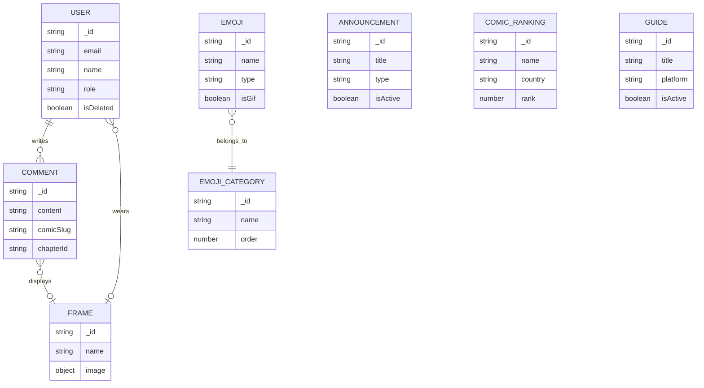

# Data Models & Schema Architecture

## Executive Summary
This document defines the core data models, entity relationships, and type schemas in **Ztruyện Admin**. The application uses strict TypeScript interfaces (`src/types/backend.d.ts`) to mirror MongoDB backend schemas, combined with **Zod** schemas in form modules for runtime client-side validation.

---

## 1. Core Entity Models (`src/types/backend.d.ts`)

### Common Primitives & Wrappers
```typescript
export type TGender = 'male' | 'female' | 'lgbt';
export type TRole = 'admin' | 'author' | 'user';
export type TProvider = 'local' | 'google' | 'facebook';
export type TType = 'text' | 'image';
export type TTypeAnnouncement = 'info' | 'warning' | 'maintenance' | 'event';
export type TPlatform = 'Android' | 'IOS' | 'PC' | 'None';

export interface ICreated {
    _id: string;
    createdAt: string;
}

export interface IImage {
    _id: string;
    url: string;
}
```

### User & Authentication Entities
```typescript
export interface IUserLogin {
    _id: string;
    name: string;
    email: string;
    role: TRole;
}

export interface ILogin {
    access_token: string;
    user: IUserLogin;
}

export interface IUserProfile extends IUserLogin {
    bio?: string;
    cover?: IImage;
    avatar?: IImage;
    avatar_frame?: IFrame;
    birthday: string;
    age: number;
    gender: TGender;
    provider: TProvider;
    createdAt: string;
    updatedAt: string;
}

export interface IUser extends IUserProfile {
    isDeleted: boolean;
}
```

### Avatar Frame Entity
```typescript
export interface IFrame {
    _id: string;
    name: string;
    image: IImage;
    createdAt: string;
    updatedAt: string;
}
```

### Comment Entity
```typescript
export interface IUserComment {
    _id: string;
    name: string;
    avatar: IImage;
    avatar_frame: IFrame;
}

export interface IComment {
    _id: string;
    userId: IUserComment;
    comicSlug: string;
    comicName: string;
    chapterId: string;
    chapterName: string;
    replyTo: { _id: string; name: string };
    page: number;
    parent: string;
    content: string;
    likeCount: number;
    replyCount: number;
    createdAt: string;
    updatedAt: string;
    isLiked: boolean;
}
```

### Emoji & Category Entities
```typescript
export interface ICategoryEmoji {
    _id: string;
    name: string;
    name_unsigned: string;
    image: IImage;
    order: number;
    isActive: boolean;
    createdAt: string;
    updatedAt: string;
}

export interface IEmoji {
    _id: string;
    name: string;
    type: TType;
    text?: string;
    image?: IImage;
    category: ICategoryEmoji;
    isActive: boolean;
    isGif: boolean;
    createdAt: string;
    updatedAt: string;
}
```

### Announcement Entity
```typescript
export interface IAnnouncement {
    _id: string;
    title: string;
    content: string;
    type: TTypeAnnouncement;
    isActive: boolean;
    createdAt: string;
    updatedAt: string;
}
```

### Comic Ranking Entity
```typescript
export interface IComic {
    _id: string;
    name: string;
    slug: string;
    thumb_url: string;
    authors: string[];
    status: string;
    genres: string[];
    latest_chapter: string;
    chapter_api_data: string;
    country: string;
    rank: number;
    createdAt: string;
    updatedAt: string;
}
```

### Guide Entity
```typescript
export interface IGuide {
    _id: string;
    title: string;
    slug: string;
    description: string;
    platform: TPlatform;
    content: string;
    isActive: boolean;
    createdAt: string;
    updatedAt: string;
}
```

---

## 2. Entity Relationship Overview



---

## 3. Client-Side Form Validation (Zod Schemas)

The application leverages **Zod** paired with **React Hook Form** to ensure data integrity before submitting payloads to the API.

### Key Validation Patterns
1. **User Creation & Update (`src/modules/User`):** Validates email format, minimum password length (if creating), name, gender (`male`, `female`, `lgbt`), role (`admin`, `author`, `user`), and birthday.
2. **Password Change:** Enforces matching `password` and `confirmPassword` fields.
3. **Comic Ranking Creation (`src/modules/Ranking`):** Validates comic slug, name, country selection, and numerical rank order.
4. **Emoji & Category Forms (`src/modules/Emoji`):** Validates required name strings, category selection, and conditionally requires image file uploads or text content depending on emoji type (`image` vs `text`).
5. **Announcement & Guide Forms:** Validates title, rich text/markdown content, platform selection, and active toggle state.
